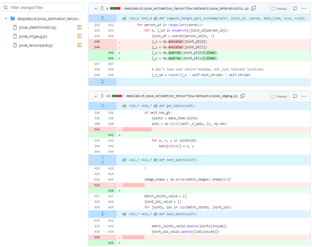

# Automated Resolution of ML issues using ChatGPT
_Internship at Applied Artificial Intelligence Institute_

## Method
### Dataset
The dataset contains 140 GitHub issues relating to machine learning (ML) code. Each input contains the project's name, issue URL, issue number and the PR that fixed the issue.
### Acquire Human's Solution
To get the human solution to fix the issue so I could compare ChatGPT's performance with, I looked at the commit that got merged into the main branch by the owner, which means it has been verified. I then got the diff between this commit and and the last one before that. By this way, I will the which lines of codes were changed and in which files.

### Prompt

## Evaluation Metrics
### Performance

### Comparison with Human's answer

## Results

## Conclusion
