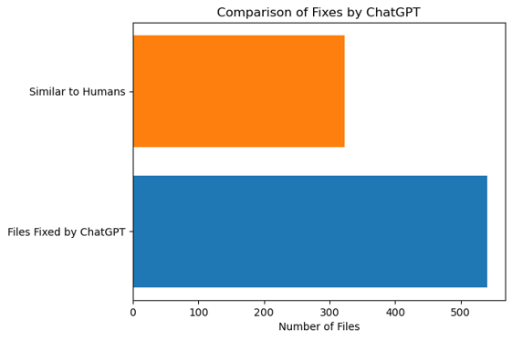
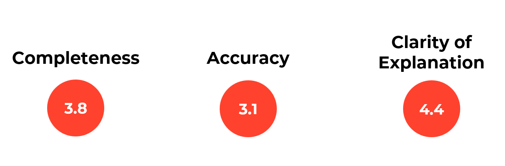
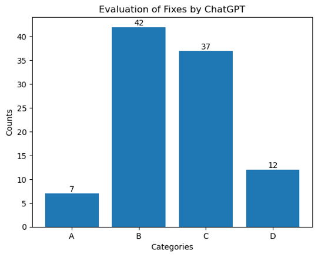

# Automated Resolution of ML issues using ChatGPT
_Internship at Applied Artificial Intelligence Institute_

## Method
### Dataset
The dataset contains 140 GitHub issues relating to machine learning (ML) code. Each input contains the project's name, issue URL, issue number and the PR that fixed the issue.
### Acquire Human's Solution
To get the human solution to fix the issue so I could compare ChatGPT's performance with, I looked at the commit merged into the main branch by the owner, which means it has been verified. I then got the diff between this commit and and the last one. This way, I will the which lines of codes were changed and in which files.

Now, I had a list of all the files changed and the human's solution
### Prompt
For ChatGPT, I used ChatGPT4 API to ensure the latest technology and highest token limit possible. For the prompt that goes into ChatGPT, each contains:
* Issue's content
* List of the files that need to be fixed
* Each code file content
* Return the solution in diff format
Because of the limited duration of this internship, I provided ChatGPT with only the code files that needed to be changed so that I can save time and it didn't need to go through every code file in the repository.

## Evaluation Metrics
To evaluate how well ChatGPT performed in resolving these issues, I divided it into 2 categories: performance and similarity to human answers.
### Performance
* **Completeness**: 1-5
* **Accuracy:** 1-5
* **Clarity of Explanation**: 1-5
### Comparison with Human's answer

## Results

## Conclusion
* ChatGPT shows potential in fixing ML code
* May lack the contextual understanding of human experts who possess deep expertise and domain knowledge, enabling them to understand the nuances and intricacies of machine learning code
* Valuable as a complementary tool to support human experts
* Can assist in generating initial solutions, providing alternative approaches, or offering insights
→ Human involvement remains essential to provide expertise, domain knowledge, and critical thinking in complex scenarios.
